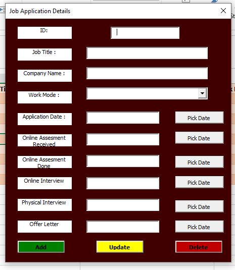

# Job Applications Userform
# Job Application Tracker

A user-friendly Excel VBA application designed to help job seekers organize and track their job applications throughout the recruitment process.

## Overview

The Job Application Tracker is a custom VBA UserForm that allows users to efficiently manage their job search by recording application details, interview dates, and offer letters all in one centralized location. This tool helps job seekers stay organized and maintain visibility over their application pipeline.

## Features

### Application Management
- **Unique Application ID**: Auto-generated or manual ID assignment for each application
- **Job Details**: Track job title and company name
- **Work Mode**: Specify work arrangement (Remote, Hybrid, On-site, etc.)
- **Application Date**: Record when you submitted your application

### Interview Tracking
- **Online Assessment Received**: Date when you received online assessment invitation
- **Online Assessment Done**: Date when you completed the assessment
- **Online Interview**: Record virtual interview date
- **Physical Interview**: Track in-person interview date
- **Offer Letter**: Document offer letter receipt date

### Data Operations
- **Add**: Create new application records
- **Update**: Modify existing application details
- **Delete**: Remove application records from tracking

### Date Picker Integration
- Built-in date picker functionality for easy date selection
- Ensures consistent date formatting across all entries

## Technical Specifications

### Built With
- **Language**: VBA (Visual Basic for Applications)
- **Platform**: Microsoft Excel
- **Interface**: Custom UserForm

### System Requirements
- Microsoft Excel 2010 or later
- Windows or macOS with Excel installed
- Macros must be enabled

## Installation

1. Download the Excel file containing the VBA project
2. Open the file in Microsoft Excel
3. Enable macros when prompted
4. Access the Job Application Tracker through the designated button or shortcut

### Enabling Macros

**Windows:**
1. Go to File > Options > Trust Center > Trust Center Settings
2. Click on Macro Settings
3. Select "Enable all macros" (or "Disable all macros with notification")

**macOS:**
1. Go to Excel > Preferences > Security & Privacy
2. Under Macro Security, select your preferred option

## Usage

### Adding a New Application

1. Click the **Add** button to create a new record
2. Fill in the required fields:
   - Job Title
   - Company Name
   - Work Mode (select from dropdown)
   - Application Date
3. Add interview and assessment dates as they occur
4. The system will automatically assign an ID or you can enter one manually

### Updating an Application

1. Select the application record you want to modify
2. Make the necessary changes in the form fields
3. Click the **Update** button to save changes

### Deleting an Application

1. Select the application record you want to remove
2. Click the **Delete** button
3. Confirm the deletion when prompted

### Using Date Pickers

1. Click the **Pick Date** button next to any date field
2. Select the desired date from the calendar
3. The date will be automatically populated in the corresponding field

## Use Cases

- **Job Search Organization**: Keep all application information in one place
- **Interview Preparation**: Track upcoming interviews and prepare accordingly
- **Follow-up Management**: Know when to follow up based on application and interview dates
- **Success Metrics**: Analyze your job search effectiveness by tracking conversion rates
- **Application History**: Maintain a record of companies applied to and interview outcomes

## Data Fields

| Field Name | Type | Required | Description |
|------------|------|----------|-------------|
| ID | Number | Yes | Unique application identifier |
| Job Title | Text | Yes | Position applied for |
| Company Name | Text | Yes | Employer name |
| Work Mode | Dropdown | Yes | Remote/Hybrid/On-site |
| Application Date | Date | Yes | Date application submitted |
| Online Assessment Received | Date | No | Assessment invitation date |
| Online Assessment Done | Date | No | Assessment completion date |
| Online Interview | Date | No | Virtual interview date |
| Physical Interview | Date | No | In-person interview date |
| Offer Letter | Date | No | Offer receipt date |

## Future Enhancements

- [ ] Add application status tracking (Applied, Interviewing, Offer, Rejected)
- [ ] Export data to CSV/PDF for reporting
- [ ] Dashboard with visual analytics (charts, graphs)
- [ ] Email reminder integration for follow-ups
- [ ] Salary range tracking
- [ ] Notes/comments section for each application
- [ ] Job description attachment capability
- [ ] Search and filter functionality
- [ ] Mobile-friendly version

## Contributing

Contributions are welcome! If you'd like to improve this project.

## Author

**Cynthia Njeri Mburu**
- LinkedIn: [linkedin.com/in/cynthianjeri](https://linkedin.com/in/cynthianjeri)
- Email: cynthia20njeri@gmail.com

## License

This project is open source and available under the [MIT License](LICENSE).

## Acknowledgments

- Inspired by the need for better job application organization
- Built to help fellow job seekers stay organized during their career search
- Thanks to the VBA community for documentation and support

## Support

If you encounter any issues or have questions:
1. Check the Issues section for similar problems
2. Create a new issue with detailed description
3. Contact via email for direct support

---

**Note**: This is a personal project designed to help job seekers manage their applications. Feel free to customize it to fit your specific needs!

## Screenshots

### Main Interface
The UserForm provides an intuitive interface for managing all aspects of your job applications from submission through offer acceptance.

### Key Benefits
✅ **Organized**: Keep all application data in one place  
✅ **Efficient**: Quick data entry with date pickers  
✅ **Trackable**: Monitor your entire application pipeline  
✅ **Professional**: Maintain detailed records for follow-ups  

---

*Last Updated: February 2026*
